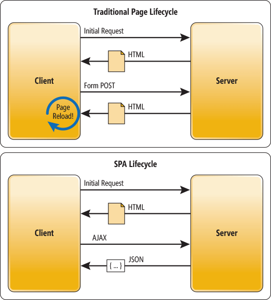
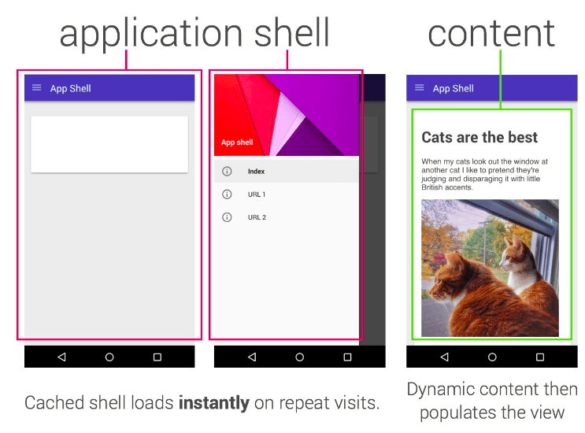

# React Basics

- [Grundlagen](#grundlagen)
  - [Single Page Applications](#single-page-applications)
  - [Progressive Web Apps](#progressive-web-apps)
- [Konzepte, Technologien und Architekturen im Frontend](#konzepte-technologien-architekturen-im-frontend)
  - [App Shell Model](#app-shell-model)
  - [State Management](#state-management)
  - [Flux](#flux)
  - [JSX](#jsx)
  - [Code-Splitting](#code-splitting)
  - [Serverseitiges Rendern](#serverseitiges-rendern)
- [React Technologien und Konzepte](#react-technologien-und-konzepte)
  - [Komponenten](#komponenten)
    - [Arten](#arten)
      - [Dumb Components](#dumb-components)
      - [Smart Components](#smart-components)
      - [Higher Order Components (HOCs)](#higher-order-components-hocs)
    - [Children](#children)
    - [Rendern](#rendern)
    - [Bedingtes Rendern](#bedingtes-rendern)
    - [Events](#events)
    - [Styling](#styling)
    - [Lifecycle](#lifecycle)
  - [State Management in React](#state-management-in-react)
    - [setState](#setstate)
    - [Context](#context)
    - [MobX](#mobx)
    - [Redux](#redux)
    - [Auswahlhilfe](#auswahlhilfe)
  - [Type Checking und Static Types](#type-checking-und-static-types)
    - [PropTypes](#proptypes)
    - [Flow](#flow)
    - [TypeScript](#typescript)
  - [Reconciliation](#reconciliation)
  - [Error Boundaries](#error-boundaries)
  - [React Router](#react-router)
  - [Strict Mode](#strict-mode)
- [Literaturverzeichnis](#literaturverzeichnis)

Die folgende Mind-Map visualisiert den Zusammenhang der Inhalte:


## Grundlagen
Als grundlegende Einführung soll im Folgenden zunächst ein Überblick über einige Basics bezüglich der Entwicklung von modernen Frontend-Applikationen geschaffen werden. Hierzu werden die Begriffe "Single Page Application" und "Progressive Web App" vorgestellt.
Im Anschluss des Kapitels werden Konzepte, Technologien und Architekturen im Frontend vorgestellt sowie spezielle React Technologien und Konzepte erläutert.
React ist eine komponentenbasierte JavaScript Bibliothek zur Erstellung von User-Interfaces und wurde 2013 von Facebook veröffentlicht. Sie ist plattformunabhängig und unter der MIT-Lizenz kostenfrei verfügbar.

### Single Page Applications

Webseiten bzw. Webanwendungen können auf unterschiedliche Arten umgesetzt werden. Eine Möglichkeit der Unterscheidung besteht darin, "traditionelle" Webseiten und Single Page Applications (SPAs) zu differenzieren.
Eine Gegenüberstellung des traditionellen Lifecycles einer Webseite im Vergleich zu dem Lifycycle einer Single Page Application wird in der folgenden Abbildung dargestellt:



Abbildung entnommen aus [[WASS13]](#ref_wass13)

In der Abbildung wird der grundsätzliche Unterschied beider Typen deutlich.

Traditionell sendet der Client (Browser) eine initiale Anfrage an den Server, der wiederum mit einer HTML-Datei antwortet. Die Datei wird dann im Browser angezeigt. Wechselt der Benutzer die Seite (z.B. durch das Klicken eines Links), wird eine weitere Anfrage an den Server geschickt. Dieser den HTML-Inhalt der neuen Webseite, woraufhin beim Client ein **erneutes Laden**  durchgeführt wird.

Bei Single Page Applications wird initial ebenfalls eine "normale" Anfrage an den Server versendet und von diesem ein (meist sehr kleiner) HTML-Inhalt zurückgeliefert. Von hier an unterscheidet sich der Lifecycle jedoch vom traditionellen Verfahren. Es werden AJAX- (Asynchronous JavaScript and XML) statt HTML-Anfragen an den Server gesendet, woraufhin dieser typischerweise mit JSON Strings antwortet. Hierbei wird **kein erneutes Laden** der Webseite durchgeführt.


Da die Webseiten nicht neu geladen werden müssen, bieten sie den Benutzern i.d.R. ein "flüssigeres" Erlebnis. Zudem wird durch das Separieren der Daten (JSON) und der Anzeige (HTML) das Entwerfen von gut strukturierten Webanwendungen vereinfacht.
Idealerweise kann das HTML-Markup ohne das Ändern der Logik angepasst werden.

Bei einer reinen Single Page Application wird jegliche UI-Interaktion beim Client durch JavaScript und CSS durchgeführt, sodass der Server nach der anfänglichen Anfrage nur noch als eine Art "Service-Schicht" fungiert. 
Somit kann sowohl der Server als auch der Client einfach ausgetauscht werden, sofern die neuen Module die entsprechende Schnittstelle bedienen 
[[WASS13]](#ref_wass13).

### Progressive Web Apps

Eine Progressive Web App (PWA) ist eine mobile Webseite, die den Nutzern als herkömmliche (native) Anwendung erscheint. Die Webseiten zeichnen sich durch folgende Merkmale aus:

*Reliable*

Wenn die Anwendungen vom Home-Screen gestartet werden, laden sie (unabhängig vom Netzwerkstatus) quasi sofort.

*Fast*

Allgemein schnelle Ladezeiten

*Engaging*

Sie sind ohne App Store installierbar, erscheinen (wie native Apps) als Vollbild-Anwendung und können Push Notifications versenden. 

Zu den Vorteile von PWAs zählen unter anderem [[GOOG18a]](#ref_goog18a):

* Sie können als Webanwendung auf dem Home Screen der Nutzer verfügbar sein
* Schnelleres initiales Laden (weniger Datenverkehr)
* Web Push Notifications können dabei helfen, dass Nutzer mehr Zeit auf einer Webseite verbringen [(siehe Fallstudie)](https://developers.google.com/web/showcase/2016/extra)

Zur Unterstützung beim Testen von Progressive Web Apps, stellt Google [eine Checkliste und ein Tool](https://developers.google.com/web/progressive-web-apps/checklist) zur Verfügung, anhand derer eine Anwendung dahingehen geprüft werden kann, ob sie Googles Kriterien an eine PWA erfüllt [[GOOG18b]](#ref_goog18b).

Zu diesen Kriterien gehören beispielsweise:

* Die Webseite wird über HTTPS geliefert
* Die Webseiten ist responsive (für Tablets und Mobilgeräte)
* Alle URLs laden offline
* Die Seitenübergänge sind flüssig


Eine Architekturart, die das Erstellen von PWAs erleichtern soll, wird im Kapitel [App Shell Model](#app-shell-model) vorgestellt.

<a name="konzepte-technologien-architekturen-im-frontend"></a>
## Konzepte, Technologien und Architekturen im Frontend

Dieses Kapitel soll einen Überblick über einige Konzepte, Technologien und Architekturen in Bezug auf die Entwicklung von Frontend-Anwendungen vermitteln. Hierzu werden zunächst die App Shell Architektur für PWAs sowie die Motivation für durchdachte State Management Ansätze in Frontend-Anwendungen dargelegt. Anschließend wir das unidirektionale Frontend-Architekturmuster Flux und die Themengebiete JSX, Code-Splitting sowie serverseitiges Rendern vorgestellt.   

### App Shell Model

App Shell Model (oder Application Shell Model) ist eine Architektur, die das Erstellen von zuverlässigen und sofort ladenden Progressive Web Apps ermöglicht. 
Die folgende Abbildung zeigt den grundsätzlichen App-Aufbau.


Abbildung entnommen aus <a>[[OSMA18]](#ref_osma13)</a>

Die "Applpication Shell" besteht aus wenigen HTML, CSS und JavaScript Bestandteilen, die die grobe App-Struktur definieren. Dieses Grundgerüst kann im Offline-Cache gespeichert werden, wodurch ein erneutes Laden der Anwendung schnell und ohne eine Netzwerkverbindung durchgeführt werden kann. Der benötigte Seiteninhalt ("Content") wird anschließend aus dem Netzwerk geladen und anschließend in die Shell eingebettet.

Single Page Applications können dieses Verfahren z.B. mithilfe von sogenannten "Service Workern" durchführen. Hierbei handelt es sich um Skripte, die vom Browser im Hintergrund ausgeführt werden, um beispielsweise Antworten auf Anfragen offline zu cachen [[GRUN18]](#ref_grun18), [[OSMA18]](#ref_osma18).

Besondern viel Sinn macht diese Art der Architektur bei der Entwicklung von Webanwendungen, deren Navigationelemente gleich bleiben, sich ihr Inhalt jedoch ändern kann.  

### State Management

Je komplexer eine Anwendung wird, desto mehr Zustände kann sie einnehmen und desto schwieriger wird dementsprechend das Verwalten ihrer Zustände sowie der entsprechenden Zustandsübergänge. In der Regel verfügen solche Anwendungen über viele Komponenten, die auf bestimmte Zustände reagieren sollen. Die meisten Interaktionen des Benutzers mit der Applikation ändern den Zustand der beteiligten Konmponeten. Angefangen mit dem Betätigen von Schaltflächen, dem Aus- bzw. Abwählen von Checkboxfeldern, bis hin zum Ändern des Wertes einer Combobox. Um diese Komplexität meistern zu können, bedarf es eines strukturierten und durchdachten Konzepts zum Verwalten der Zustände. Dieser Vorgang wird *State Management* genannt. 

Da dieser Themenbereich die meisten Frontend Anwendungen betrifft, verfügen aktuelle Bibliotheken und Frameworks in der Regel über Pakete, die dem Entwickler beim State Management unterstützen. 

Das Kapitel [State Management in React](#state-management-in-react) beschreibt einige Möglichkeiten des State Managements im React-Kontext.

### Flux

Flux ist ein Architektur Pattern, das beim Erstellen von User Interfaces verwendet werden kann, um eine bessere Nachvollziehbarkeit der Zustandsänderungen zu erreichen. Es wurde erstmals 2014 von Facebook vorgestellt. Facebook nutzt Flux für Ihre React Projekte, da das Verwenden eines bidirektionalen MVC-Ansatzes - in Verbindung mit der Größe ihrer Projekte - eine hohe Komplexität schafft [[FACE14]](#ref_face14). 

Die folgende Abbildung soll diesen Sachverhalt verdeutlichen:

<a name="ref_mvc_achitecture"></a>

Abbildung entnommen aus [[AVRA14]](#ref_avra14)

Im Gegensatz dazu handelt es sich bei Flux um ein unidirektionales Pattern.


Die prinzipielle Architektur von Flux wird in der folgenden Abbildung dargestellt:

<a name="ref_flux_achitecture"></a>

Abbildung entnommen aus [[TSON18]](#ref_tson18)

Das Pattern besteht aus 4 Bestandteilen [[TSON18]](#ref_tson18):

**Action**

Ereignisse/Benachrichtigungen, die Informationen/Daten an den Dispatcher weiterleiten. Sie werden von der View oder sonstigen Services (z.B. HTTP Anfragen) ausgelöst. 

Typischerweise handelt es sich bei einer Action um ein Objekt, das über zwei Attribute verfügt.
* *type*: Um welche Action handelt es sich? (Eine Art ID)
* *payload*: Objekt, das die Nutzdaten enthält

Eine Action, bei der eine Person zu einer Liste hinzugefügt werden soll, könnte folgendermaßen aussehen:

```javascript
{
  type: 'ADD_PERSON',
  payload: {
    forename: 'Max'
    surname: 'Mustermann'
  }
}
```

Um eine bessere Tool-Unterstützung erhalten zu können, kann statt des Strings 'ADD_PERSON' für den Typ (`type`) aus dem obigen Beispiel auch z.B. ein Enum-Wert verwendet werden. Wichtig ist hierbei nur, dass der Aktionstyp eindeutig ist und der Wert somit keiner weiteren Aktion zugeordnet wird. In JavaScript kann dies zum Beispiel mithilfe von `Symbol()` erreicht werden (siehe [Mozilla Beschreibung](https://developer.mozilla.org/en-US/docs/Web/JavaScript/Reference/Global_Objects/Symbol)). 

Die Implementierung für eine Liste von Personen könnte wie folgt aussehen:

```javascript
const PersonActions = Object.freeze({
    ADD: Symbol("ADD_PERSON"),
    DELETE: Symbol("DELETE_PERSON"),
    MODIFY: Symbol("MODIFY_PERSON")
});
```

**Dispatcher**

Der Dispatcher ist der hauptsächliche Akteur. Alle eingehenden Ereignisse des Systems (bzw. *Actions*) werden im Dispatcher gesammelt und von dort aus an die entsprechenden *Stores* verteilt.
Aus diesem Grund können hier sehr gut Logger zu Debugzwecken eingesetzt werden.

**Store**

Die Stores empfangen die Benachrichtigungen vom Dispatcher und ändern auf Basis der neuen Informationen ggf. ihren Zustand, um Änderungen in der entsprechenden View auszulösen. Im Prinzip handelt es sich bei den Stores somit um das Model im MVC-Pattern. 

Aufgrund der einzigartigen Action-Types werden die Daten jeweils nur zu einem Store weitergeleitet, sodass man sich die einzelnen Stores prinzipiell auch als einen großen Store vorstellen kann.

**View**

Die Views dienen der Anzeige der Daten. Sie abonnieren Stores und können Actions auslösen. Bei React sind die Views beispielsweise die entsprechenden React Anzeige-Komponenten.

### JSX
Viele moderne Frontend-Frameworks und -Bibliotheken verwenden JavaScript nicht nur für die reine Logik der Webanwendungen, sondern auch für das Strukturieren der GUI. Dies ermöglicht z.B. ein dynamisches Befüllen der Webseite auf Basis der Werte von JavaScript Variablen. Eine Möglichkeit die syntaktischen Unterschiede zur gewohnten HTML-Schreibweise zu reduzieren, ist der Einsatz von JSX.

JSX erweitert die Programmiersprache JavaScript, indem es eine XML/HTML-artige Struktur zur Programmierung der GUI-Elemente innerhalb des JavaScript Codes erlaubt. Damit aus einem JSX-Code standardmäßiges JavaScript wird, muss der Code übersetzt werden. Dieser Vorgang wird oftmals mithilfe des JavaScript-Compilers "Babel" durchgeführt. Sehr populär ist JSX in Verbindung mit React. Streng genommen ist JSX zwar kein zwingendes Muss bei der Verwendung von React, jedoch ist zu vermuten, dass viele Entwickler die JSX-Version dem kompilierten JavaScript Äquivalent aufgrund der Übersichtlichkeit bevorzugen. Außerdem können so hilfreichere Tool-Unterstützungen (Warnungen, Fehler etc.) angezeigt werden [[FACE18a]](#ref_face18a).

Als Beispiel soll folgender JSX-Code dienen:

```jsx
function render() {
    return (
      	<div>
          <h1>Master Informatik</h1>
          <h2>Campus Minden</h2>
          <h3>Modulname:</h3>
          <input type="text" autoFocus name="moduleName"/>
    	</div>
    );
};
```
Mit HTML vertraute Personen werden vermutlich erahnen können, welche Ausgabe dieser JSX-Code erzeugt. Es wird ein div-Container erstellt, der die Überschriften "Master Informatik" (h1-Element), "Campus Minden" (h2-Element), "Modulname:" (h3-Element) sowie ein Text-Eingabefeld enthält. Das Eingabefeld hat den Namen "moduleName" und erhält beim Erzeugen der Komponente den Eingabefokus.

Dieser Code wird von Babel für React Anwendungen folgendermaßen übersetzt:

```javascript
function render() {
    return React.createElement("div", null,
             React.createElement("h1", null, "Master Informatik"),
             React.createElement("h2", null, "Campus Minden"),
             React.createElement("h3", null, "Modulname:"),
             React.createElement("input", {
                 type: "text", 
                 autoFocus: true, 
                 name: "moduleNameInput"
             })
    );
};
```

*Das Beispiel lässt sich [hier](https://babeljs.io/repl/#?babili=false&browsers=&build=&builtIns=false&spec=false&loose=false&code_lz=GYVwdgxgLglg9mABAJwKZgCauQCgJSIDeAUAJBpQjJI7GL0OkA8GMAbgHx0M_1MAWARg4BZAIYBnKNkQBJMMDjIAtmNgBrJgHohXXrwEAmDgGExygA4gJiETEzpt_Y9319-AZlFwMIADZg5qgAXE5erm5M9lZQiFAAnhaoALwARNIAHlCpiGIgUHAAYnAQ1oiByimpyj7-qAByQTlaeozarJwReADcxAC-vcRAA&debug=false&forceAllTransforms=false&shippedProposals=false&circleciRepo=&evaluate=false&fileSize=false&sourceType=module&lineWrap=true&presets=es2015%2Creact%2Cstage-2&prettier=false&targets=&version=6.26.0&envVersion=) online ansehen und bearbeiten.*

Da es sich bei den JSX-Elementen um JavaScript-Objekte handelt, können diese auch Variablen zugewiesen werden:

```jsx
const header = <h1>Das ist eine Überschrift</h1>;  
```

Des Weiteren lässt sich auch weiterer JavaScript Code direkt als sogenannte "Expression" einfügen, indem dieser in geschweifte Klammern gesetzt wird:

```jsx
const items = ["book", "pen"];
const itemCounter = <div>Anzahl an Items: {items.length}</div>;

// ===============================================================
// Render-Ausgabe:
//     Anzahl an Items: 2
// ===============================================================
```

### Code-Splitting

Bei der Entwicklung von modernen Web Applikationen werden in der Regel eine Vielzahl an einzelnen Paketen verwendet. Tools wie browserify oder webpack bündeln die einzelnen Bestandteile zu einer großen Datei. Hierdurch kann eine Anwendung als Ganzes innerhalb einer Webseite inkludiert werden.

Bei größeren Single Page Applications kann dies zu Problemen führen, da alle Daten geladen werden müssen, obwohl der Benutzer eventuell gar nicht alle Bereiche der Anwendung verwenden wird. Um diesem Problem aus dem Weg zu gehen, kann *Code-Splitting* eingesetzt werden.

Code-Splitting ermöglicht es, die Bestandteile einer Webanwendung in verschiedene Bereiche aufzuteilen und diese erst bei Bedarf zu laden (quasi *lazy loading*).

In Verbindung mit beispielsweise *webpack* kann hierzu die dynamische `import()`-Syntax verwendet werden [[FACE18g]](#ref_face18g).

Ohne Code-Splitting:
```javascript
import { SubMenu } from './SubMenu';

SubMenu.open();
```

Mit Code-Splitting:
```javascript
// webpack führt hier ein Code-Splitting durch 
import("./SubMenu").then(module => {
  module.SubMenu.open();
});
```

Im Folgenden werden zwei weitere Möglichkeiten vorgestellt, wie ein Code-Splitting in Frontendanwendungen durchgeführt werden kann. Auch wenn es sich bei den speziellen Implementierungen um React-Varianten handelt, sind die Prinzipien (komponentenbasiert/routenbasiert) universell einsetzbar. 

*Aus Gründen der Übersichtlichkeit werden die React-spezifischen Implementierungen bereits hier vorgestellt. Sollte der Quellcode nicht direkt verständlich sein, ist es ggf. sinnvoll diesen Abschnitt zu überspringen und sich die Passagen nach dem Durcharbeiten des React-Kapitels noch einmal anzuschauen.*

**Komponentenbasiertes Code-Splitting**

Bei diesem Ansatz, wir das Code-Splitting auf Basis des "Komponentenzustands" durchgeführt. Der Code wird geladen, sobald die Komponente angefordert wird.

Speziell für React kann hierfür die Bibliothek [React Loadable](https://github.com/jamiebuilds/react-loadable) verwendet werden. Sie bietet einen Wrapper für das Code-Splitting und bietet zudem z.B. die Möglichkeit, während des Ladevorganges eine andere Komponente oder einen anderen Text anzuzeigen. Es handelt sich um eine Higher Order Component (HOC), die [Promises](https://developer.mozilla.org/de/docs/Web/JavaScript/Reference/Global_Objects/Promise) für das Laden von Komponenten bereitstellt (HOCs werden im Kapitel [Higher Order Components (HOCs)](#higher-order-components-hocs) vorgestellt) [[REAC18]](#ref_reac18). 


Ohne Code-Splitting:
```jsx
import { SomeComponent } from './SomeComponent';

const SomeContainer = () => (
  <SomeComponent/>
);
```

Mit Code-Splitting:
```jsx
import Loadable from 'react-loadable';

const SomeLoadableComponent = Loadable({
  // wird geladen, wenn die Komponente angefordert wird
  loader: () => import('./SomeComponent'),
  // wird so lange angezeigt, bis die Komponente geladen ist
  loading: () => <div>Loading...</div>,
  // zeige Ladetext erst nach 0,2 Sekunden an
  delay: 200
});

const SomeContainer = () => (
  <SomeLoadableComponent/>
);
```

**Routenbasiertes Code-Splitting**

Das Code-Splitting kann auch direkt auf Basis der aktuellen Route durchgeführt werden, sodass nur die mit der Route verbundene Komponente/Webseite geladen wird. 

Mithilfe von Bibliotheken wie [React Router](https://reacttraining.com/react-router/) und [React Loadable](https://github.com/jamiebuilds/react-loadable) kann dies bei React realisiert werden. Hierbei erhält jede Route eine eigene Komponente, die als Loadable implementiert wird [[FACE18g]](#ref_face18g):

```jsx
import { BrowserRouter, Route, Switch } from 'react-router-dom';
import Loadable from 'react-loadable';

const Loading = () => <div>Loading...</div>;

const Home = Loadable({
  loader: () => import('./routes/Home'),
  loading: Loading,
});

const About = Loadable({
  loader: () => import('./routes/About'),
  loading: Loading,
});

const App = () => (
  <BrowserRouter>
    <Switch>
      <Route exact path="/" component={Home}/>
      <Route path="/about" component={About}/>
    </Switch>
  </BrowserRouter>
);
```


### Serverseitiges Rendern

Bei der Erstellung von Webanwendungen kann die Webseite prinzipiell auf verschiedenen Arten gerendert werden. 

*Clientseitiges Rendern:*

Der Browser lädt eine einfache HTML Datei, deren Inhalt durch JavaScript befüllt wird

*Serverseitiges Rendern (SSR):*

Der **Startinhalt** wird auf dem Server generiert, sodass der Browser die Daten als HTML-Seite laden kann. Updates werden jedoch weiterhin im Browser gehandhabt [[LASN18]](#ref_lasn18).

Zur Beantwortung der Frage, ob ein serverseitiges Rendern verwendet werden sollte, bietet [diese](https://www.javascriptstuff.com/server-side-render/) Webseite einen guten Überblick.

Vorteile:
* SEO (Search Engine Optimization) Verbesserung möglich (Google, Bing etc.)
* In der Regel bessere clientseitige Performance

Nachteile:
* Der Server wird stärker beansprucht, wodurch HTTP Antworten verzögert werden können
* Die Größe der HTML-Datei steigt und diese braucht somit länger zum Downloaden (i.d.R. vernachlässigbar)
* Die Komplexität der Anwendung nimmt zu

Zur Vereinfachung von SSR in React-Applikationen, kann das Framework *[Next.js](https://nextjs.org/)* verwendet werden. Hierbei wird zudem ein automatisches Code-Splitting durchgeführt.


Alternativ zu SSR kann auch [prerender](https://prerender.io/) verwendet werden.
Hierbei handelt es sich um eine Middleware, die Crawlern eine vorgerenderte Version der Webseite für eine bessere SEO zurückliefert [[LASN18]](#ref_lasn18). 

## React Technologien und Konzepte

Den Abschluss des React-Frontend-Kapitels sollen React spezifische Technologien und Konzepte darstellen. Angefangen mit einer Einführung in die Entwicklung von Komponenten, sollen grundlegende React-Kenntnisse aufgebaut werden. Bestandteil dieses Abschnittes sind unter anderem die verschiedenen Arten von Komponenten - inklusive des Patterns "Higher Order Component" - sowie des bedingten Rendern und des internen Lifecycles von React-Komponenten. Im Anschluss werden einige Möglichkeiten des State Managements und Type Checkings innerhalb von React Anwendungen vorgestellt. 
Abschließend folgen weiterführende React-Themen in Form der Reconciliation (der Aktualisierungsstrategie des virtuell aufgebauten DOMs), der Error Boundaries, der Routing Möglichkeiten mit React sowie des Strict Modes.  

### Komponenten

Bei der Entwicklung von Webanwendungen mit React spielen Komponenten eine zentrale Rolle. Im Folgenden werden deshalb einige Grundlagen der Komponentenentwicklung mit React vorgestellt.

#### Arten
Grundsätzlich unterscheidet man zwei Arten von Komponenten. Die sogenannten "Dumb Components" und die "Smart Components". Zusätzlich werden in diesem Abschnitt noch die Higher Order Components vorgestellt, die genau genommen ein Entwurfsmuster für Komponenten darstellen.

##### Dumb Components

Dumb Components verfügen über keinen Zustand (*state*). Das heißt, dass sie einmalig Eigenschaften zugewiesen bekommen (*properties*, im Folgenden auch *props* genannt) und auf Basis dieser Werte ihr Aussehen anpassen. 

*Anmerkung:* Es ist darauf zu achten, dass JavaScript standardmäßig über keine Typprüfung verfügt und somit auch die Verwendung der Properties ein sorgsames Vorgehen verlangt. Möglichkeiten der statischen Typprüfung werden im Kapitel [Type Checking und Static Types](#type-checking-und-static-types) vorgestellt.

Das nachfolgende Beispiel zeigt eine beispielhafte Dumb Component.

```jsx
const Header = (props) => {
  return (
    <div>
      { props.title }
    </div>
  )
}
```

 Die Komponente wird in der Variable "Header" als Arrow Function gespeichert. Die Funktion erhält die Properties in Form eines JavaScript Objekts als Parameter. Die übergebenen Eigenschaften werden dort als Key-Value Paare (`props`) bereitgestellt. Im obigen Beispiel wird der Wert des Schlüssels `title` innerhalb eines div-Containers angezeigt.  

 Die Properties werden im JSX als Attribut angelegt: 

 ```jsx
<Header title="Informatik Minden" />

 /// Das hierzu gehörige Property-Objekt sieht folgendermaßen aus:
 /// const props = {
 ///   title: "Informatik Minden"
 /// }
 ```

##### Smart Components

Im Gegensatz zu Dumb Components verfügen Smart Components über einen Zustand (`this.state`). Hierbei handelt es sich wie bei den Properties (`this.props`) um ein Objekt, das aus Key-Value Paaren besteht. Besonders ist hierbei jedoch, dass sich der Zustand innerhalb des Lebenszyklus der Komponente ändern kann. 

Smart Components werden in Form von Klassen realisiert. Ihre Properties erhalten sie dabei als Parameter ihres Konstruktors. Die folgende Komponente stellt einen Zähler dar, der als Property einen Startwert (`props.startValue`) erhält und bei Betätigung des Buttons den Zähler um eins erhöht. Dieser Zähler wird als Zustandsvariable (`this.state.count`) realisiert und mithilfe der Rendermethode angezeigt (die Rendermethode wird im Kapitel [Rendern](#rendern) genauer betrachtet). 

```jsx
class Counter extends React.Component {
  constructor(props) {
    // Aufruf des Konstruktors von React.Component
    super(props);
    // der Startwert des Zählers muss als Property übergeben werden
    this.state = { count: props.startValue };
    // diese "Bindung" wird später erklärt; bitte erst einmal ignorieren
    this.increment = this.increment.bind(this);
  }
  // Zählerzustand um 1 erhöhen
  increment() {
    this.setState({
      count: this.state.count + 1
    })
  }
  // Wird automatisch aufgerufen, wenn die Komponente gerendert werden soll
  render() {
    return (
      <div>
        <button onClick={this.increment}>+1</button>
        <h1>Aktueller Wert: {this.state.count}</h1>
      </div>
    );
  }
}
```

Bei der Verwendung des Zustands ist zu beachten, dass Werte von Zustandsvariablen mit der asynchronen Methode `setState()` geändert werden müssen, damit die Änderungen korrekt durchgeführt werden. Die Methode erhält ein Objekt mit den Key-Value Paaren, die geändert werden sollen. Auf diese Art und Weise wird die Anzeige direkt nach dem Ändern eines Zustandswertes aktualisiert. Das Kapitel [State Management in React](#state-management-in-react) beschreibt weitere Details zur Verwendung von `setState()` und alternative Möglichkeiten zum Verwalten des Zustands von React-Komponenten. Informationen zum Lifecycle von Smart Components finden sich im Kapitel [Lifecycle](#lifecycle).

##### Higher Order Components (HOCs)
Higher Order Components erweitern Komponenten, indem sie ihnen zusätzliche Funktionalitäten oder Properties zur Verfügung stellen (vgl. Decorator Pattern der GoF) [[TSON18]](#ref_tson18). Möchte man beispielsweise bei jedem Mounting- und Rendervorgang von Komponenten eine Log-Nachricht ausgeben, müsste man den gleichen Code an vielen Stellen des Projekts einbauen (in den Methoden `componentDidMount()` und `render()` der jeweiligen Komponente). Eine HOC kann hier Abhilfe schaffen:

```jsx
// HOC
function withLogger(WrappedComponent) {
  // Liefert eine neue Klasse zurück, die die übergebene
  // Komponente WrappedComponent "umschließt"
  return class extends React.Component {
    
    // Wird aufgerufen, wenn die Komponente zum DOM hinzugefügt wird
    componentDidMount() {
      console.log(this.props.prefix + ' component did mount')
    }

    // Wird aufgerufen, wenn die Komponente gerendert wird
    render() {
      console.log(this.props.prefix + ' render')
      // Mit "{...this.props}" werden alle Properties des HOCs kopiert,
      // sodass die erweiterte Komponente diese erhält.
      // Es können auch weitere Properties hinzugefügt werden.
      // Weitere Infos hierzu: Nach "Spread-Operator" suchen
      return (
        <WrappedComponent {...this.props}> />
      )
    }
  }
};
```

Bei der HOC handelt es sich um eine Art Factory-Methode, die als Parameter die zu erweiternde Komponente erhält und auf Basis dieser die high-order Komponente erstellt.

Dementsprechend wird die Funktion wie folgt aufgerufen:
```jsx
// Beispielhafte Dumb Component, die erweitert werden soll
const Title = (props) => <h1>{props.title}</h1>;

// Aufruf der HOC
const LoggedComponent = withLogger(Title);
```

Die so erstellte Komponente kann anschließend wie üblich verwendet werden:
```jsx
<LoggedComponent 
    prefix="LoggedComponent:" // Property für den Logger
    title="HOC Test"          // Property für die Komponente
/>           
```

Es wird außerdem deutlich, dass hierdurch auch die Logik und die Anzeige besser voneinander getrennt werden können, wodurch die Wiederverwendbarkeit der einzelnen Teile verbessert wird. Die eigentliche Anzeige kann hierdurch oftmals durch Dumb Components realisiert werden. Es ist z.B. denkbar, dass eine HOC Daten aus dem Netz abruft und sie diese dann einer zustandslosen "Anzeigekomponente" zur Verfügung stellt [[CHAN17]](#ref_chan17). Ebenso könnte eine HOC die Konfiguration einer anderen Komponente übernehmen. All das erleichtert zudem das Testen der Komponenten, da die Aufgaben strikter getrennt werden und dadurch Mock-Komponenten einfacher erstellt werden können [[TSON18]](#ref_tson18).

#### Children

Die vorherigen Beispiele haben bereits gezeigt, dass die grafische Oberfläche von React-Anwendungen aus hierarchisch strukturierten Elementen besteht. Innerhalb von Komponenten kann auf deren direkte Nachfahren mithilfe von `props.children` (Dumb Component) bzw. `this.props.children` (Smart Component) zugegriffen werden.

Eine Liste von Items kann beispielswiese wie folgt realisiert werden:
```jsx
const List = (props) => {
  return (
    <div>
      <p>Anzahl an Items: {React.Children.count(props.children)}</p>
      <ul>
        {props.children}
      </ul>
    </div>
  )
}
```
Dieser Komponente können im Aufruf beliebig viele Kind-Elemente hinzugefügt werden:

```jsx
  <List>
    <li>Item 1</li>
    <li>Item 2</li>
  </List>
  
  //======================
  // Ausgabe:
  //======================
  // Anzahl an Items: 2
  //  • Item 1
  //  • Item 2
  //======================
```
#### Rendern

Wie bereits der Name vermuten lässt, ist `render()` die Rendermethode von Smart Components. Sie wird aufgerufen, wenn die Komponente im Browser dargestellt werden soll (siehe Kapitel [Lifecycle](#lifecycle)). Als Rückgabewert erhält sie genau **ein** React Element. 
Ist es erforderlich, dass mehrere Elemente zurückgegeben werden, müssen diese in einem Container (z.B. `<div>`) gebündelt werden. 

Beispiel:
```jsx
render() {
  return (
    <div> { /* zwingend erforderlicher Container */ }
      <ChildA />
      <ChildB />
      <ChildC />
    </div>
  );
}
```

Hieraus resultiert ein weiteres Element im DOM (ein `<div>` Element). 
Diesen Umstand kann man durch Verwendung von *Fragments* umgehen. Sie gruppieren die Elemente, ohne selber im DOM eingefügt zu werden [[FACE18d]](#ref_face18d).

```jsx
render() {
  return (
    <React.Fragment> { /* erscheint nicht im DOM */ }
      <ChildA />
      <ChildB />
      <ChildC />
    </React.Fragment>
  );
}

// Oder mit der neuen Schreibweise: <> und </>
// (wird noch nicht von allen Tools unterstützt)
render() {
  return (
    <> { /* erscheint nicht im DOM */ }
      <ChildA />
      <ChildB />
      <ChildC />
    </>
  );
}
```

Um Komponenten letztendlich im Browser anzuzeigen, wird die Funktion `ReactDOM.render()` verwendet. Diese erhält als ersten Parameter die zu rendernde React Komponente und als zweiten Parameter das tatsächliche DOM-Element (Containers), als dessen Kind-Element die Komponente in den nativen DOM eingefügt worden soll:

```jsx
ReactDOM.render(
  <AppComponent />,                 // React Komponente
  document.getElementById('root')   // Container-Position im DOM
);

```
#### Bedingtes Rendern
Aufgrund des in JSX - also JavaScript - eingebetteten Codes für das Rendern von Komponenten, kann ein bedingtes Rendern relativ einfach umgesetzt werden. Im folgenden Beispiel wird, abhängig vom Zustand der Komponente, entweder ein "Start"- oder ein "Stopp"-Button angezeigt. 

```jsx
class StartStopButton extends React.Component {
  constructor(props) {
    super(props);
    this.state = { isRunning: false };
    
    // kann erst mal ignoriert werden
    this.start = this.start.bind(this);
    this.stop = this.stop.bind(this);
  }
  
  start() {
    this.setState({ isRunning: true });
  }
  stop() {
    this.setState({ isRunning: false });
  }

  render() {
    return (
      {/* hier findet die "Entscheidung" statt */}
      this.state.isRunning 
      ?
        {/* wird gerendert, falls this.state.isRunning true ist */}
        <button onClick={this.stop}>
          Stopp
        </button>
      :
        {/* wird gerendert, falls this.state.isRunning false ist */}
        <button onClick={this.start}>
          Start
        </button>
      );
  }
}
```

Statt des hier verwendeten Konditionaloperator (`... ? ... : ...`) kann auch z.B. ein `if` verwendet werden. In diesem Fall darf die entsprechende Logik jedoch nicht "inline" in das `return`-Statement eingebaut werden, sondern muss als separater Code davor eingefügt werden. 

Beispiel: 

```jsx
// ...
render() {
    let button; // Rückgabewert, enthält im Folgenden das          
                // anzuzeigende Element
    if (this.state.isRunning) {
      button = (
        <button onClick={this.stop}>
          Stopp
        </button>
      );
    } else {
        button = (
          <button onClick={this.start}>
            Start
          </button>
       );
    }
    return button;
  }
}
//...
```

#### Events

*Im Folgenden wird eine beispielhafte Komponente betrachtet, die aus einem Button besteht, der bei Aktivierung (Betätigung der Schaltfläche) eine Funktion mit dem Namen "start" aufruft.*

Wie bereits in den vorherigen Beispielen ersichtlich, erfordert die Verwendung von UI-Komponenten oftmals eine ereignisbasierte Interaktion mit den einzelnen Elementen. Bei React Elementen werden die Events ähnlich wie bei herkömmlichen DOM Elementen gehandhabt.


HTML:
```html
<button onclick="start()">
  Start
</button>
```
JSX:
```jsx
<button onClick={start}>
  Start
</button>
```

In diesem Beispiel sind prinzipiell zwei Unterschiede zu erkennen:

1. Die Eventnamen entsprechen den herkömmlichen Bezeichnungen in *camelCase* Schreibweise
2. Die verbundenen Event-Handler werden als `{Expression}` (siehe [JSX](#jsx) Kapitel) eingebunden

Meistens werden die Event-Handler innerhalb einer Klassenkomponente in Form von Klassenmethoden realisiert. Soll innerhalb des Handlers `this` in Bezug auf die aktuelle Klasse verwendet werden, muss sichergestellt werden, dass die Klassenmethode an die Klasse gebunden wird (man spricht von "bound"). Wird eine Funktion nicht gebunden, bezieht sich `this` in JavaScript i.d.R. auf den *Aufrufer*.

React bietet verschiedene Möglichkeiten dieser Problematik entgegenzuwirken [[FACE18c]](#ref_face18c).

**Bindung im Konstruktor**
```jsx
class StartButton extends React.Component {
  constructor(props) {
    super(props);

    // Hier wird die Methode an diese Komponente gebunden
    this.start = this.start.bind(this);
  }
  
  start() {
    this.doStuff(); // "this" kann hier normal verwendet werden
  }

  // ...

  render() {
    return (
      <button onClick={this.start}>
        Start
      </button>
    );
  }
}
```

**Public class field Syntax (*experimentelles Feature*)**
```jsx
class StartButton extends React.Component {
  // !!! Experimentelles Feature !!!
  // Babel konvertiert diese Funktion zu einer öffentlichen Klassenmethode.
  // Je nach Projekteinstellung ist diese Funktion ggf. standardmäßig nicht aktiviert 
  start = () => {
    this.doStuff(); // "this" kann hier normal verwendet werden
  }

  // ...

  render() {
    return (
      <button onClick={this.start}>
        Start
      </button>
    );
  }
}
```

**Arrow Function (*nicht empfohlen*)**

Arrow Functions verfügen in JavaScript nicht über ein eigenes `this` und umgehen somit die angesprochene Problematik [[MOZI18]](#ref_mozi18). Diese Art der Programmierung wird jedoch nicht empfohlen, da jeder Rendervorgang der Komponente eine neue Funktion erzeugt. Wird dieser Callback als Property an andere Komponenten weitergegeben, werden diese eventuell ebenfalls neu gerendert , wodurch die Performance leidet.

```jsx
class StartButton extends React.Component {

  start() = {
    this.doStuff(); // "this" kann hier verwendet werden
  }

  // ...

  render() {
    return (
      <button onClick={() => this.start()}>
        Start
      </button>
    );
  }
}
```

Den Callback-Methoden können ebenfalls Parameter mitgegeben werden [[FACE18c]](#ref_face18c):

```jsx
const someValue = 1;

// ...

<button onClick={(event) => this.start(someValue, event)}>Start</button>
// oder
<button onClick={this.start.bind(this, someValue)}>Start</button>
```

In beiden Fällen wird das React Event als zweiter Parameter an die Methode `start()` übergeben. Werden bei `bind()` mehrere Parameter übergeben, wird der Eventparameter entsprechend nach hinten verschoben. Die Parameterübergabe geschieht dort implizit und muss somit nicht angegeben werden. 

#### Styling
Das Styling von React Komponenten kann prinzipiell auf unterschiedliche Arten geschehen. Im Folgenden werden drei häufig verwendete Verfahren vorgestellt.

**CSS**

Das Aussehen von Elementen kann z.B. direkt über herkömmliche CSS-Dateien angepasst werden.
Es ist darauf zu achten, dass das `class`-Attribut in JSX `className` lautet.
Das `id`-Attribut kann wie von HTML gewohnt verwendet werden.

Beispiel:

*.css*
```css
.red-text {
  color: red;
}

#some-id {
  font-size: 12px;
}
```
*.jsx*
```jsx
function someComponent() {
  return <div className="red-text" id="some-id">Roter Text</div>;
}
```
 Bei der Verwendung von CSS ist darauf zu achten, dass die Style-Definitionen standardmäßig global definiert werden, wodurch unerwünschte Seiteneffekte entstehen können.
>*Two CSS properties walk into a bar. A barstool in a completely different bar falls over. - [Thomas Fuchs](https://twitter.com/thomasfuchs/status/493790680397803521?lang=de)*

 In Verbindung mit den Bundle-Tools [webpack](https://webpack.github.io/) oder [browserify](http://browserify.org/) können auch [CSS-Modules](https://github.com/css-modules/css-modules) verwendet werden. Hierbei werden die Klassen- und Animationsnamen standardmäßig als lokal angelegt.

***style*-Attribut**

Eine weitere Möglichkeit ist das Verwenden des Attributs `style` . Dem Attribut kann ein JavaScript Objekt zugewiesen werden, dass über die aus CSS bekannten Attribute verfügt. Hierbei ist darauf zu achten, dass die Style-Bezeichner ihrem CSS-Äquivalent als *camelCase* entsprechen. So wird `font-size` z.B. zu `fontSize`. Außerdem müssen Werte, die keine reine Zahl sind, als String übergeben werden.

Beispiel:

```jsx
const redTextStyle = {
  color: 'red',
  fontSize: '12px',
};

// ...

function someComponent() {
  return <div style={redTextStyle}>Roter Text</div>;
}
```


**Styled Components**

Darüber hinaus kann z.B. auch die Bibliothek [*styled-components*](https://www.styled-components.com/) verwendet werden. Diese verwendet ebenfalls eine Mischung aus CSS und JavaScript. Als Kennung für eine Style-Beschreibung dient das Gravis-Symbol ( ` ) am Anfang und Ende des Styles. Hierbei wird eine String-Interpolation mit [Tagged Template-Strings](https://developer.mozilla.org/de/docs/Web/JavaScript/Reference/template_strings) durchgeführt, wodurch eine React-Komponente erzeugt wird, die zum Rendern verwendet werden kann. Vorteilhaft ist hierbei, dass der Style lokal gehalten wird und somit direkt mit der jeweiligen Komponente verbunden wird. Die Bibliothek verfügt darüber hinaus über weitere Features, wie das Verwenden von Themes oder dem Verändern des Styles auf Basis von Properties.

Beispiel:
```jsx
const RedText = styled.div`
    color: red;
    font-size: 12px;
`;

// ...

function someComponent() {
  return <RedText>Roter Text</RedText>;
}
```
#### Lifecycle

Der Lebenszyklus einer React Klassenkomponente besteht aus verschiedenen Schritten und Phasen. Die nachfolgende Abbildung zeigt deren Zusammenhang zueinander. Es existieren noch weitere Lifecycle-Methoden. Da diese jedoch als veraltet gelten und mit der Version 17 entfernt werden, werden diese im Folgenden außer Acht gelassen. Als Informationsquelle für diesen Abschnitt wird, sofern nicht anders angegeben, [[FACE18b]](#ref_face18b) verwendet.

<a name="ref_lifecycles"></a>

Abbildung bearbeitet; entnommen aus <a>[[MAJ18]](#ref_maj18)</a> (dort als interaktive Abbildung vorhanden)

**Mounting**

Noch bevor die Komponente zum DOM hinzugefügt wurde (man spricht hierbei von "mounted"), wird ihr Konstruktor (`constructor(props)`) aufgerufen. Hierbei sollte darauf geachtet werden, dass als erstes der Konstruktor der Basisklasse aufgerufen wird (`super(props)`), da andernfalls das Klassenattribut `this.props` noch nicht definiert ist und es somit zu Bugs kommen kann. Der Konstruktor sollte zur Initialisierung des Objektzustands verwendet werden (mit `this.state={...}`; hier nicht `setState()` verwenden, damit der Wert direkt gesetzt wird und kein erneuter Rendervorgang ausgelöst wird).

Nachdem das Objekt initialisiert wurde, wird die Methode `getDerivedStateFromProps(nextProps, prevState)` aufgerufen.  Als Rückgabewert wird ein Objekt erwartet, das den Zustand auf Basis der angepassten Properties enthält oder `null`, um zu signalisieren, dass sich der Zustand auf Basis der Props nicht geändert hat. Um zu prüfen, welche Props sich geändert haben (bzw. ändern werden), kann der Parameter `nextProps` mit den aktuellen Properties des Objekts verglichen werden.

Es folgt der Aufruf von `render()` und anschließend das Updaten des "nativen DOMs" und der "refs" (Verweise auf die Elemente des nativen DOMs).

Mit dem Aufruf von `componentDidMount()` endet der Mounting-Vorgang. Innerhalb dieser Methode können beispielsweise Initialisierungen eingebaut werden, die Zugriff auf den nativen DOM benötigen oder Netzwerkzugriffe durchgeführt werden (AJAX-Requests). Obwohl `render()` bereits ausgeführt wurde, kann der Zustand hier jedoch noch mit `setState()` aktualisiert werden, bevor die Änderungen tatsächlich im Browser sichtbar werden (`render()` würde in dem Fall erneut aufgerufen werden; Achtung, die Performanz kann hierunter leiden).

**Updating**

React Komponenten können in ihrem Lebenszyklus auf 3 verschiedene Arten aktualisiert werden. 

*New props*

Sie können von ihrem hierarchischen Vater (bezogen auf die ReactDOM-Hierarchie) neue Props erhalten. In diesem Fall wird die Methode `getDerivedStateFromProps()` (s.o.) erneut aufgerufen. Der Unterschied zum Aufruf während des Mounting-Vorgangs ist, dass nun vor `render()` eine weitere Methode aufgerufen wird, mithilfe der entschieden werden kann, ob ein erneutes Rendern wirklich erforderlich ist. Es handelt sich um die Methode `shouldComponentUpdate(nextProps, nextState)`. Standardmäßig liefert sie `true` zurück, sodass der Rendervorgang durchgeführt wird. Implementiert man diese Methode und gibt `false` zurück (z.B. weil die neu erhaltenen Props keine Relevanz für die Anzeige haben), wird der Update-Vorgang ohne Rendern abgeschlossen. 

*setState()*

Ein durch `setState()` geänderter Zustand ruft `shouldComponentUpdate()` ebenfalls auf.

 *forceUpdate()*

Ein Aufruf der Methode `forceUpdate()` initiiert ebenfalls ein erneutes Rendern. Nach Möglichkeit sollte `forceUpdate()` nur aufgerufen werden, wenn eine GUI-Änderung andernfalls nicht bemerkt werden würde (das sollte im Normallfall jedoch nicht notwendig sein).

Bevor die Änderungen in den nativen DOM übertragen werden, wird die Methode `getSnapshotBeforeUpdate(prevProps, prevState)` aufgerufen. Hiermit können Werte gespeichert werden, die sich potentiell nach dem Update ändern könnten (z.B. eine Scrollbar-Position). Alle Bestandteile des Rückgabewertes werden an die Methode `componentDidUpdate(prevProps, prevState[, snapshot])` weitergeleitet. Diese Methode wird demnach aufgerufen, nachdem die Änderungen im nativen DOM angepasst wurden. 

**Unmounting**

Unmittelbar bevor eine Komponente unmountet und zerstört wird, wird die Methode `componentWillUnmount()` aufgerufen. Sie dient zum Aufräumen von Timern, Netzwerkverbindungen etc.


**Abschlussbemerkung**

Zusätzlich zu den hier vorgestellten Lifecycle-Methoden existiert auch noch die Methode `componentDidCatch(error, errorInfo)`. Diese erzeugt aus der aktuellen Klasse eine *Error Boundary Klasse*, die JavaScript-Fehler innerhalb ihrer Kinderelemente fängt. Weiterführende Informationen finden sich im Kapitel [Error Boundaries](#error-boundaries).

### State Management in React

Wie bereits im Kapitel [State Management](#state-management) erläutert, bedarf das Erstellen von dynamischen Webseiten einer guten Strategie zur Verwaltung des Zustandes der Webseite. Im Folgenden werden einige Möglichkeiten des State Managements einer React-Anwendung vorgestellt.

#### setState

Eine einsteigerfreundliche Variante des State Managements ist das Verwenden der bereits in vorherigen Kapiteln angesprochenen asynchronen Methode `setState()`. Jede smarte Komponente verfügt über einen Zustand. Dieser Zustand wird als JavaScript-Objekt in dem Klassenattribut `this.state` gespeichert und mithilfe von `setState()` aktualisiert (vgl. Kapitel [Dumb Components und Smart Components](#dumb-components-und-smart-components)). Mit steigender Anwendungsgröße steigt auch die Komplexität eines solchen direkten State Managements. Das rührt daher, dass die Verbindungen (Bindings) explizit als Property bis an die untersten Komponenten weitergeführt werden müssen, um dort aktiv zu werden [[LABO18]](#ref_labo18). 

#### Context
Um ein umständliches Weiterreichen der Statusinformationen in Form von Properties aus dem Weg zu gehen, verfügen die neusten React Versionen über das kontextbasierte Verfahren *Context*. Es sollte dort genutzt werden, wo bestimmte Daten als global angesehen werden können (z.B. Benutzerdaten und GUI-Themes).

Das Verfahren verwendet einen "Provider & Consumer" Ansatz (Anbieter und Verbraucher).
Die Provider verfügen über Daten, die von Consumern abonniert werden können. Letztere werden über Änderungen der abonnierten Daten informiert.

Die Verwendung von Context ist recht simpel [[FACE18f]](#ref_face18f):

*Schritt 1: Kontext erzeugen*

```javascript
// Erzeugt ein Kontextpaar: {Provider, Consumer}
// defaultValue wird von Consumern verwendet, die keinen 
// passenden Provider im JSX-Baum "über" sich haben   
const MyContext = React.createContext(defaultValue);
```

*Schritt 2: Kontext verwenden*
```jsx
<div>
  // Kontext setzen
  <MyContext.Provider value={someContextValue}>
    ...
    <MyContext.Consumer> {
        contextValue => (
          // Hier das Element rendern, das auf den Wert des Kontextes angewiesen ist.
          // Der Kontext kann über "contextValue" gelesen werden
        )
    }
    </MyContext.Consumer>
    ...
  </MyContext.Provider>
</div>
```

#### MobX 
Eine weitere Möglichkeit des State Managements bietet die JavaScript Bibliothek *MobX*. Sie basiert auf Observer und Observables, die auch aus dem Observer Pattern bekannt sind. MobX verfügt über einen unidirektionalen Datenfluss, der in etwa wie Flux abläuft:


Abbildung bearbeitet; entnommen aus [[PURN16]](#ref_purn16)

Events triggern *Actions*, die den *State* modifizieren. Auf Basis dessen werden wiederum *Computed Values* automatisch berechnet und die Änderungen der *View* entsprechend bekanntgemacht. Es ist jedoch auch möglich, einen *State* direkt mit der *View* zu verknüpfen. Die *View* kann selber auch Events zum triggern von *Actions* auslösen.

Das Verwenden dieser Bibliothek ist recht einfach [[MOBX18]](#ref_mobx18):

*Schritt 1: Zustandsobjekt definieren und als observable kennzeichnen*

```javascript
import {observable} from 'mobx';

var counterState = observable({
    value: 0 
});
```

*Schritt 2: Eine View als Observer erstellen*
```jsx
import {observer} from 'mobx-react';

// ESnext Decorator
// Syntax ohne Decorator:
// "export observer(CounterView)" am Ende der Datei
@observer
class CounterView extends React.Component {
    constructor(props) {
      super(props);
      this.increment = this.increment.bind(this);
    }
    render() {
        return (
          <div>
            <button onClick={this.increment}>+1</button>
            <h1>Aktueller Wert: {this.props.counterState.value}</h1>
          </div>
        );
    }
    
    increment () {
      // siehe Schritt 3
      this.props.counterState.increment();
    }
};
```

*Schritt 3: Zustandsobjekt modifizieren*
```javascript
import {action} from 'mobx';

counterState.increment = action(() => {
    counterState.value += 1;
});
```

*Schritt 4: Komponente und Zustandsobjekt verbinden*
```jsx
// "counterState" wird als normale Property verwendet 
ReactDOM.render(<Counter counterState={this.props.counterState} />, document.body);
```

Zur Debug-Unterstützung kann die Browser-Extension [MobX Developer Tools
](https://github.com/mobxjs/mobx-devtools) genutzt werden.

#### Redux
Redux ist eine weitere JavaScript Bibliothek, die (i.d.R. genau) einen "Zustands-Container" (*state-container*) zur Hilfe bei der Verwaltung des Datenflusses einer Applikation bereitstellt. Die Architektur erinnert ebenfalls an die Flux Architektur, siehe nachfolgende Abbildung. Für die Verwendung von Redux mit React kann man die Bibliothek [react-redux](https://github.com/reactjs/react-redux) verwenden.


Abbildung entnommen aus [[TSON18]](#ref_tson18)

Redux besteht aus vier Bestandteilen [[TSON18]](#ref_tson18):

**Action**

Die Actions verhalten sich analog zu den Actions des Flux Patterns, jedoch ist ihr Aufbau leicht abgeändert. Statt des Attributs "payload" werden die Nutzdaten direkt an das Action-Objekt angefügt:

```javascript
{
  type: 'ADD_PERSON',
  forename: 'Max'
  surname: 'Mustermann'
}
```

*Randbemerkung*: 

Es wird empfohlen möglichst wenig Nutzdaten in eine Aktion einzubinden. Statt der gesamtem Informationen kann beispielsweise ein Index übergeben werden, mithilfe dessen die Informationen aus einer Liste o.ä. entnommen werden können [[REDU18]](#ref_redu18). 

**Reducer**

Da Redux i.A. nur über einen State-Container verfügt, wird kein Dispatcher benötigt. Stattdessen verwendet Redux Reducer.
Dies sind Funktionen, die den aktuellen Zustand eines Stores sowie eine Action erhalten und auf Basis dieser Informationen den neuen Zustand zurückgeben. Reducer müssen zwingend die folgenden beiden Eigenschaften erfüllen, damit das zugrundeliegende Pattern von Redux nicht verletzt wird:

* Es muss sich um eine sogenannte *Pure Function* handeln, d.h. der Ausgabewert der Funktion ist bei gleicher Eingabe immer gleich

* Die Funktion darf keine Seiteneffekte besitzen, d.h. keine globalen Variablen verwenden, keine asynchronen Aufrufe tätigen etc.  

Das folgende Beispiel stellt einen einfachen Reducer für ein Array von Personen dar. Es erhält den aktuellen Zustand (ein Array mit den aktuell vorhandenen Personen) sowie die auszuführende Action. Anhand des Action-Attributes *type* wird die auf den Zustand anzuwendende Aktion ausgewählt und der neue Zustand anschließend zurückgegeben (als tiefe Kopie!). Der Zustand selber ist somit **immutable** und kann z.B. mithilfe der Browser-Erweiterung [Redux DevTools](https://github.com/zalmoxisus/redux-devtools-extension) komfortabel gedebuggt werden. 
Speichert man sich die tiefen Kopien als Historie ab, kann man auf einfache Art und Weise "Undo-Funktionalitäten" realisieren.

Aus Gründen der Übersichtlichkeit wird in dem Beispiel von dem aktuellen Zustand `state` jedoch *keine* tiefe Kopie erzeugt. Dies müsste bei einer Implementation entsprechend angepasst werden.
 
```javascript
const personReducer = (state, action) => {
  switch (action.type) {
    case 'ADD_PERSON':
      return [
        // Die bisherigen Personen
        // Achtung, keine tiefe Kopie!
        ...state,
        // Neue Person anfügen
        {
          forename: action.forename,
          surname: action.surname
        }
      ]
    case 'REMOVE_PERSON':
      //...
    // case ... 
    // Sonstige Actions
    // ...
    default:
      // Fehlerbehandlung...
  }
}
```

**React (View):** 

Die Anzeige; analog zu Flux.

**Store** 

Das Model; prinzipiell analog zu Flux, jedoch als "Single-Store". Verwendet Reducer für seine Zustandsübergänge.


#### Auswahlhilfe

Neben den erwähnten Möglichkeiten existieren viele weitere Bibliotheken für das Verwalten von Zuständen. Die Auswahl des richtigen Werkzeugs ist dementsprechend nicht immer einfach. 

Die folgenden Fragen sollen die Auswahl für die vorgestellten Verfahren vereinfachen [[LABO18]](#ref_labo18):

Soll es **keine externen Abhängigkeiten** geben?

    setState oder Context verwenden

Steht die **Einfachheit** im Vordergrund?
    
    MobX verwenden

Ist die **Skalierbarkeit** wichtig?

    Redux verwenden

### Type Checking und Static Types

Standardmäßig ist JavaScript eine dynamisch typisierte Programmiersprache. Möchte man dennoch Type-Checking-Methodiken oder statische Typisierung in JavaScript verwenden, bedarf es zusätzlicher Bibliotheken/Tools. Im Folgenden werden in diesem Zusammenhang PropTypes, Flow und TypeScript vorgestellt.

#### PropTypes
Durch das Importieren des Packets "prop-types" erhält man Zugriff auf das in React eingebaute Type Checking Werkzeug *PropTypes*. Mithilfe von PropTypes kann überwacht werden, ob alle benötigten Properties einer Komponente übergeben wurden und ob der Typ des Übergabewertes korrekt ist.

Im folgenden Beispiel wird ein zwingend notwender String `title` sowie optionale Kindelemente `children` als Properties festgelegt. 

Hierzu wird der Komponenten eine Variable mit dem Namen `propTypes` zugewiesen. Innerhalb dieser Variable werden die Properties und deren Typen definiert. Das Anfügen von `isRequired` führt dazu, dass der Property zwingend ein Wert des angegebenen Typs zugewiesen werden muss.
Ist dies nicht der Fall, erscheint eine entsprechende Fehlermeldung in der Konsole des verwendeten Browsers. Ebenso erscheint eine Fehlermeldung, wenn einer Property ein Wert falschen Typs zugewiesen wurde.

```jsx
import PropTypes from 'prop-types';

class Header extends React.Component {
  render() {
    return (
      <div>
        <h1>{this.props.title}</h1>
        {this.props.children}
      </div>
    );
  }
}

Header.propTypes = {
  title: PropTypes.string.isRequired, // zwingend notwendig
  children: PropTypes.element         // optional
};
```

Es können viele Typen überprüft werden, z.B.:
* `PropTypes.string`
* `PropTypes.number`
* `PropTypes.array`
* `PropTypes.bool`
* `PropTypes.func` -> Funktion
* `PropTypes.element` -> React Element
* `PropTypes.instanceOf(<Klasse>)`
* `PropTypes.oneOf(['EnumA', 'EnumB'])` -> wie eine Enumeration

PropTypes überprüft die Typen aus Gründen der Performance nur im "development mode" [[FACE18e]](#ref_face18e).


#### Flow

Flow ist ein Static Type Checker für JavaScript Applikationen. Er kann zum Ersetzen von PropTypes genutzt werden. Darüber hinaus können mit Flow jedoch nicht nur die Properties, sondern auch z.B. die Typen von Parametern und Rückgabewerten überprüft werden [[CLAR17]](#ref_clar17). 

Damit eine Datei von Flow überprüft wird, muss sie folgendermaßen markiert werden:

```javascript
// @flow
```
Der im letzten Kapitel vorgestellte PropTypes Code kann beispielsweise wie folgt mithilfe von Flow ersetzt werden:

```jsx
// @flow
type Props = {
  title: string,         // zwingend notwendig
  children?: React.Node, // optional
};

class Header extends React.Component<Props> {
  render() {
    return (
      <div>
        <h1>{this.props.title}</h1>
        {this.props.children}
      </div>
    );
  }
}
```

*Überprüfung von Parametern:*
```javascript
// @flow
function myLoggerFunction(text: string): void {
  console.log(text)
}

myLoggerFunction(2); // Fehler
```

*Flow analysiert den Quellcode auch ohne das explizite Angeben von Typen:*
```javascript
// @flow
function add(var1, var2) {
  return var1 + var2; // Fehler
}

const a = add("1", "100");
```

#### TypeScript
TypeScript ist eine von Microsoft entwickelte Open Source Programmiersprache. Die Sprache verfügt über vielerlei Bestandteile, die aus anderen Programmiersprachen bekannt sind. Hierzu gehören Generics, Vererbung, Klassen, Interfaces, Enumerationen und vieles mehr. Ein spezieller TypeScript-Compiler kompiliert den Softwarecode zu nativen JavaScript Code.
Da die JavaScript-Sprache lediglich erweitert wird, ist herkömmlicher JavaScript Code zu TypeScript kompatibel, wodurch sich JavaScript Projekte i.d.R. recht einfach migrieren lassen. 

In TypeScript erhält jede Funktion, Variable, Schnittstelle etc. einen Typ zugewiesen. Hierdurch können viele Fehlerquellen bereits zur Kompilierzeit festgestellt werden. Darüber hinaus bieten einige Tools weitere Hilfestellungen bei der Programmierung an (z.B. das automatische Erstellen von Methodenrümpfen, die für eine Implementierung eines Interfaces notwendig sind). 

Beispielhafte Umsetzung eines Timer Interfaces und deren Implementierung:

```typescript
interface TimerInterface {
  setTimer(value: number): void;
  start(): void;
  stop(): void;
  onElapsed(): void;
  isRunning(): boolean;
}

/// Implementierung analog wie z.B. in Java
class Timer implements TimerInterface {
  setTimer(value: number): void {
    // ...
  }
  start(): void {
    // ...
  }
  stop(): void {
    // ...
  }
  onElapsed(): void {
    // ...
  }
  isRunning(): boolean {
    // ...
  }
}
```

Eine weitere wichtige Erweiterung sind die Zugriffsmodifizierer (access modifiers), die eine bessere Kapselung von Klassenfunktionalität ermöglichen. Es werden die drei klassischen Modifier unterstützt:

* `public` (*default*):  von überall aus erreichbar
* `private`: nur innerhalb der Klasse erreichbar
* `protected`: nur innerhalb der Klasse und über Vererbung erreichbar

Das Typensystem kann jedoch auch bei Verwendung von TypeScript umgangen werden. Wird als Typ `any` angegeben, findet keine Überprüfung des Typs statt.
Um solche unsauberen Lösungen zu umgehen, kann z.B. das statische Code-Analyse Tool "TSLint" verwendet werden. Wird hier die Regel `no-any` gesetzt, wird eine entsprechende Warnung bzw. ein Fehler ausgegeben. Dieses Tool kann außerdem dabei helfen, Coderichtlinien einzuhalten.

Einen schnellen Einstieg in die Entwicklung von React Anwendungen mit TypeScript und TSLint 
findet sich [hier](https://github.com/Microsoft/TypeScript-React-Starter#typescript-react-starter).

#### Reconciliation

Da das Updaten von Elementen des nativen DOMs relativ ineffizient ist, verfügt React über ein virtuelles DOM. Statt Änderungen direkt im DOM zu rendern, wird der alte virtuelle DOM mit dem aus den Änderungen resultierenden DOM verglichen. Hierbei handelt es sich um leichtgewichtige JavaScript Objekte, die in-memory gespeichert werden, sodass dort Operationen deutlich schneller durchgeführt werden können. Initial wird der virtuelle DOM mit der Funktion `ReactDOM.render()` erstellt.

Der Objektbaum wird durch das Aufrufen von `setState()` jeweils komplett neu erstellt und verglichen. Algorithmen, die die minimale Anzahl von nötigen Modifikation bestimmen, liegen bestenfalls in O(n³). Um diesen Vorgang zu beschleunigen, verwendet React den sogenannten *Reconciliation*-Algorithmus. Hierbei wird eine Heuristik verwendet, die das Problem in O(n) lösen kann. Es werden 2 Annahmen bzw. Vereinbarungen getroffen:


**1) Annahme:** Zwei Elemente unterschiedlichen Typs erzeugen unterschiedliche DOM-Bäume.

Es wird eine Breitensuche (ebenenweises Durchlaufen des Baums) durchgeführt, wobei jeweils die Typen der Elemente beider Bäume verglichen werden. 
Unterscheiden sich diese, werden die Elemente samt aller Kinder als *dirty* markiert. Komponenten, die als dirty markiert wurden, werden anschließend neu gerendert.

**2)**
Elemente können mit einem Schlüssel `key` als Identifier versehen werden. Bei einer Liste von Elementen mit solchen Keys werden folgende Schritte durchgeführt [[HOPP17]](#ref_hopp17):

Vergleiche die alte Liste mit der neuen Liste:

* Durchlaufe alle Elemente
  * Key in alter, aber nicht in neuer Liste vorhanden?
    * rufe `unmount` für die Komponente auf
  * Key in neuer, aber nicht in alter Liste vorhanden?
    * rufe `mount` Komponente auf
  * Key in beiden Listen vorhanden?
    * rufe `shouldComponentUpdate` auf, um zu entscheiden, was passieren soll

*Anmerkung:*

Seit ca. 2 Jahren arbeitet das React Team zudem an einer neuen Datenstruktur (React Fiber), die den aktuellen Algorithmus verbessern und ersetzen soll. Informationen hierzu finden sich [hier](https://gist.github.com/duivvv/2ba00d413b8ff7bc1fa5a2e51c61ba43).


### Error Boundaries

Error Boundaries (dt. Fehlergrenzen) dienen dem Einfangen von JavaScript Fehlern innerhalb der Kindelemente. Wenn Kind-Komponenten abstürzen, können diese Fehler protokolliert oder alternative GUI-Element angezeigt werden. Die Fehler werden während des Renderns, in anderen Lifecycle Methoden und auch innerhalb von Konstruktoren aufgefangen.

Um aus einer Komponente eine Error Boundary Klasse zu machen, muss lediglich die folgende Lifecycle Methode implementiert werden:

```javascript
componentDidCatch(error, errorInfo) {}
```

Die Methode erhält zwei Parameter:

* **error**: Der geworfene Fehler
* **errorInfo**: Objekt, das für Stacktrace Informationen die Variable `componentStack` bereithält


**Pro:**

* Folgt der deklarativen Natur von React (*was* soll passieren, statt *wie*)
* Error Boundary Klassen können einfach wiederverwendet werden
* Verhält sich wie zu erwarten: Fehler werden zur nächsthöheren Error Boundary Klasse weitergeleitet

**Contra:**

* ¯\\_(ツ)_/¯   ;)

In [diesem](https://codepen.io/sgroff04/pen/dVbgJy) Beispiel wird eine mögliche Realisierung implementiert [[GROF18]](#ref_grof18).

### React Router

Mit React werden hauptsächlich Single Page Applications erstellt. Aus diesem Grund ist die Webseite nicht darauf angewiesen für ihre Unterseiten verschiedene URLs zu verwenden. Solche URLs erlauben es dem Benutzer jedoch die bestimmten Seiten als Lesezeichen abzuspeichern und die Vorwärts- und Rückwärts-Pfeile des Browsers für die Navigation zu verwenden.

Damit Komponenten einer SPA trotzdem in verschiedene URL-Bereiche aufgeteilt werden können, kann bei React der [react-router](https://reacttraining.com/react-router/) verwendet werden.

```jsx
// ...

const DisplayText = ({ match }) => (
  <div>
    {match.params.text}
  </div>
);

ReactDOM.render((
  <BrowserRouter>
      <Switch>
        <Route exact path="/" component={Home} />
        <Route path="/Display/:text" component={DisplayText} />
        <Route component={Default} />
      </Switch>
    </BrowserRouter>
), document.getElementById('root'))
```

In diesem Beispiel würde ein Aufruf von "*URL*/" die Komponente `Home` aufrufen, wohingegen "*URL*/Display/Hallo" den Wert *Hallo* als Parameter `text` and die Komponente `DisplayText` übergeben würde. In allen anderen Aufrufen der URL würde die Komponente `Default` aufgerufen werden. Die Routen lassen sich auch Verschachteln, woraufhin tiefergelegene Komponenten entsprechend als `children` an die darüberliegende Komponente übergeben werden. Dieser Routing-Vorgang wird aufgrund von `<BrowserRouter>` dynamisch ausgeführt, d.h. er wird zur Laufzeit vorgenommen [[SCHE17]](#ref_sche17).

Für statische SPAs, bei denen der Server nur statische Dateien liefern kann, kann der `HashRouter` anstelle von `BrowserRouter` verwendet werden. Der `HashRouter` verwendet den Hash (#) einer URL (`window.location.hash`) zur Unterteilung. Es wird also nach einem Hash in der URL gesucht und der Text dahinter als Parameter verwendet [[TECH17]](#ref_tech17).

### Strict Mode
Strict Mode stellt sicher, dass gewisse Best Practices eingehalten werden. Durch das Einfügen von `StrictMode` in den `ReactDOM` werden die Kinderelemente dieser Komponente auf verschiedene mögliche Probleme hin überprüft [[SZCZ18]](#ref_szcz18). Wird beispielsweise eine veraltete (deprecated) Lifecycle-Methode verwendet, erscheint eine Warnung der folgenden Art:

 <a name="ref_unsafeLifecycleMethod"></a>

Abbildung entnommen aus [[SZCZ18]](#ref_szcz18)

Implementierung:
```jsx
// ...
// Versetze "ChildComponent" in den Strict Mode
render() {
  return (
    <StrictMode>
      <ChildComponent />
    </StrictMode>
  )
}
// ...
```

## Literaturverzeichnis
<a name="ref_avra14">[AVRA14]</a>: Avram, Abel: Facebook: MVC Does Not Scale, Use Flux Instead [Updated]. URL: https://www.infoq.com/news/2014/05/facebook-mvc-flux (abgerufen am 29.06.2018)

<a name="ref_chan17">[CHAN17]</a>: Tsonev, Krasimir: React Patterns. URL: https://reactpatterns.com/ (abgerufen am 09.05.2018)

<a name="ref_clar17">[CLAR17]</a>: Clark, Tyler: Quick Reference: React with Flow. URL: https://medium.com/@tylerwclark/quick-reference-react-with-flow-b404e5cd5d0e (abgerufen am 05.05.2018)

<a name="ref_face14">[FACE14]</a>: 
Facebook
: Hacker Way: Rethinking Web App Development at Facebook. URL: https://www.youtube.com/watch?v=nYkdrAPrdcw&feature=youtu.be&t=568
(abgerufen am 11.05.2018)

<a name="ref_face18a">[FACE18a]</a>: Facebook Inc.: Introducing JSX. URL: https://reactjs.org/docs/introducing-jsx.html
(abgerufen am 05.05.2018)

<a name="ref_face18b">[FACE18b]</a>: Facebook Inc.: React.Component. URL: https://reactjs.org/docs/react-component.html
(abgerufen am 05.05.2018)

<a name="ref_face18c">[FACE18c]</a>: Facebook Inc.: Handling Events. URL: https://reactjs.org/docs/handling-events.html
(abgerufen am 06.05.2018)

<a name="ref_face18d">[FACE18d]</a>: Facebook Inc.: React.Component. URL: https://reactjs.org/docs/fragments.html
(abgerufen am 06.05.2018)

<a name="ref_face18e">[FACE18e]</a>: Facebook Inc.: Typechecking With PropTypes. URL: https://reactjs.org/docs/typechecking-with-proptypes.html
(abgerufen am 06.05.2018)

<a name="ref_face18f">[FACE18f]</a>: Facebook Inc.: Context. URL: https://reactjs.org/docs/context.html#provider
(abgerufen am 06.05.2018)

<a name="ref_face18g">[FACE18g]</a>: Facebook Inc.: Code-Splitting. URL: https://reactjs.org/docs/code-splitting.html
(abgerufen am 21.05.2018)

<a name="ref_gaun18">[GAUN18]</a>: 
Gaunt, Matt: Service Workers: an Introduction. URL: https://developers.google.com/web/fundamentals/primers/service-workers/
(abgerufen am 22.05.2018)

<a name="ref_goog18a">[GOOG18a]</a>: 
Google Developers: Progressive Web Apps. URL: https://developers.google.com/web/progressive-web-apps/
(abgerufen am 22.05.2018)

<a name="ref_goog18b">[GOOG18b]</a>: 
Google Developers: Progressive Web App Checklist. URL: https://developers.google.com/web/progressive-web-apps/checklist
(abgerufen am 22.05.2018)

<a name="ref_grof18">[GROF18]</a>: 
Groff, Sean: 2 Minutes to Learn React 16's componentDidCatch Lifecycle Method. URL: https://medium.com/@sgroff04/2-minutes-to-learn-react-16s-componentdidcatch-lifecycle-method-d1a69a1f753 (abgerufen am 22.05.2018)

<a name="ref_HOPP17">[HOPP17]</a>: 
Hopper, Grace: Tech Talk: What is the Virtual DOM?. URL: https://www.youtube.com/watch?v=d7pyEDqBDeE (abgerufen am 22.05.2018)

<a name="ref_labo18">[LABO18]</a>: Labori, Gant: The React State Museum. URL: https://hackernoon.com/the-react-state-museum-a278c726315
(abgerufen am 12.05.2018)

<a name="ref_lasn18">[LASN18]</a>: Lasn, Indrek: Next.js — React Server Side Rendering Done Right. URL: https://hackernoon.com/next-js-react-server-side-rendering-done-right-f9700078a3b6
(abgerufen am 21.05.2018)

<a name="ref_maj18">[MAJ18]</a>: Maj, Wojciech: Interactive React lifecycle methods diagram. URL: https://github.com/wojtekmaj/react-lifecycle-methods-diagram
(abgerufen am 05.05.2018)

<a name="ref_mobx18">[MOBX18]</a>: MobX: The gist of MobX. URL: https://mobx.js.org/intro/overview.html
(abgerufen am 12.05.2018)

<a name="ref_mozi18">[MOZI18]</a>: Mozilla and individual contributors: Arrow functions. URL: https://developer.mozilla.org/en-US/docs/Web/JavaScript/Reference/Functions/Arrow_functions
(abgerufen am 06.05.2018)

<a name="ref_osma18">[OSMA18]</a>: Osmani, Addy: The App Shell Model. URL: https://developers.google.com/web/fundamentals/architecture/app-shell
(abgerufen am 22.05.2018)

<a name="ref_purn16">[PURN16]</a>: Purnelle, Kevin: Handling React Forms with Mobx Observables. URL: https://blog.risingstack.com/handling-react-forms-with-mobx-observables/
(abgerufen am 28.06.2018)

<a name="ref_redu18">[REDU18]</a>: Redux: Actions. URL: https://redux.js.org/basics/actions
(abgerufen am 11.05.2018)

<a name="ref_reac18">[REAC18]</a>: React Loadable: A higher order component for loading components with promises. URL: https://github.com/jamiebuilds/react-loadable (abgerufen am 21.05.2018)

<a name="ref_sche17">[SCHE17]</a>: Scherman, Paul : A Simple React Router v4 Tutorial. URL: https://medium.com/@pshrmn/a-simple-react-router-v4-tutorial-7f23ff27adf
(abgerufen am 21.05.2018)

<a name="ref_szcz18">[SZCZ18]</a>: Szczeciński, Bartosz: What’s new in React 16.3(.0-alpha). URL: https://medium.com/@baphemot/whats-new-in-react-16-3-d2c9b7b6193b (abgerufen am 21.05.2018)

<a name="ref_tech17">[TECH17]</a>: Techiediaries: React Router DOM v4 Tutorial (with Examples). URL: https://legacy.gitbook.com/book/krasimir/react-in-patterns/details (abgerufen am 22.05.2018)

<a name="ref_tson18">[TSON18]</a>: Tsonev, Krasimir: React in patterns. URL: https://legacy.gitbook.com/book/krasimir/react-in-patterns/details (abgerufen am 09.05.2018)

<a name="ref_wass13">[WASS13]</a>: Wasson, Mike: ASP.NET - Single-Page Applications: Build Modern, Responsive Web Apps with ASP.NET. URL: https://msdn.microsoft.com/en-us/magazine/dn463786.aspx
(abgerufen am 22.05.2018)

<a name="ref_zeig16">[ZEIG16]</a>: Zeigermann, Oliver ; Hartmann, Nils: React : Die praktische Einführung in React, React Router und Redux. 1. Aufl. s.l. : dpunkt, 2016 
